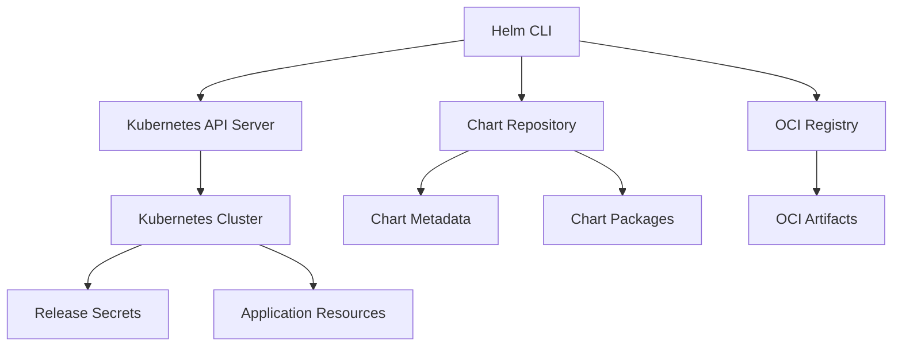

# Helm 3 Concepts and Architecture Guide

This comprehensive guide covers Helm 3 concepts, architecture, and advanced patterns for Kubernetes package management.

## Table of Contents
- [What is Helm?](#what-is-helm)
- [Core Concepts](#core-concepts)
- [Helm 3 Architecture](#helm-3-architecture)
- [Chart Structure](#chart-structure)
- [Template Engine](#template-engine)
- [Values and Configuration](#values-and-configuration)
- [Lifecycle Management](#lifecycle-management)
- [Dependencies](#dependencies)
- [Security Model](#security-model)
- [Best Practices](#best-practices)
- [Migration from Helm 2](#migration-from-helm-2)

## What is Helm?

**Helm** is the package manager for Kubernetes, often referred to as the "apt/yum for Kubernetes." It streamlines the installation and management of Kubernetes applications through packaged charts.

### Key Benefits
- **Simplified Deployment**: Deploy complex applications with a single command
- **Version Management**: Track and manage application versions and rollbacks
- **Configuration Management**: Centralized configuration with customizable values
- **Dependency Management**: Handle application dependencies automatically
- **Release Management**: Manage multiple instances of the same application

## Core Concepts

### Chart
A **Chart** is a collection of files that describe a related set of Kubernetes resources. It's the fundamental unit of deployment in Helm.

```
mychart/
├── Chart.yaml          # Chart metadata and dependencies
├── values.yaml         # Default configuration values
├── charts/             # Chart dependencies (subcharts)
├── templates/          # Template files for Kubernetes manifests
│   ├── deployment.yaml
│   ├── service.yaml
│   ├── configmap.yaml
│   └── _helpers.tpl    # Template helpers and partials
├── .helmignore         # Files to ignore during packaging
└── README.md          # Human-readable information
```

### Repository
A **Repository** is a location where charts are stored and shared. Repositories can be:
- **Public repositories**: Like Bitnami, Prometheus Community
- **Private repositories**: For internal organizational charts
- **OCI registries**: Modern container registry support
- **Local repositories**: For development and testing

### Release
A **Release** is an instance of a chart running in a Kubernetes cluster. Key characteristics:
- Each installation creates a new release
- Releases have unique names within a namespace
- Multiple releases of the same chart can coexist
- Releases maintain their own configuration and history

### Values
**Values** are the configuration parameters that customize chart behavior:
- Defined in `values.yaml` files
- Can be overridden during installation/upgrade
- Support nested structures and complex data types
- Enable chart reusability across environments

## Helm 3 Architecture

### Key Changes from Helm 2
1. **No Tiller**: Eliminates server-side component security concerns
2. **Namespace Scoped**: Resources are scoped to specific namespaces
3. **Three-Way Strategic Merge**: Better conflict resolution
4. **Improved CRD Support**: Native Custom Resource Definition handling
5. **JSON Schema Validation**: Better values validation
6. **OCI Support**: Charts can be stored in container registries

### Architecture Components



### Storage Backend
Helm 3 stores release information as Kubernetes Secrets in the same namespace as the release:
- Release history and metadata
- Configuration values
- Manifest checksums
- Status information

## Chart Structure

### Chart.yaml
The chart metadata file containing essential information:

```yaml
apiVersion: v2
name: my-application
description: A production-ready web application
type: application
version: 1.2.3
appVersion: "2.1.0"

maintainers:
  - name: DevOps Team
    email: devops@example.com

keywords:
  - web
  - api
  - microservice

home: https://github.com/example/my-application
sources:
  - https://github.com/example/my-application

dependencies:
  - name: postgresql
    version: 12.1.2
    repository: https://charts.bitnami.com/bitnami
    condition: postgresql.enabled
  - name: redis
    version: 17.4.3
    repository: https://charts.bitnami.com/bitnami
    condition: redis.enabled

annotations:
  category: ApplicationServer
  licenses: Apache-2.0
```

### Templates Directory
Contains Kubernetes manifest templates with Go templating:

#### deployment.yaml
```yaml
apiVersion: apps/v1
kind: Deployment
metadata:
  name: {{ include "myapp.fullname" . }}
  labels:
    {{- include "myapp.labels" . | nindent 4 }}
spec:
  {{- if not .Values.autoscaling.enabled }}
  replicas: {{ .Values.replicaCount }}
  {{- end }}
  selector:
    matchLabels:
      {{- include "myapp.selectorLabels" . | nindent 6 }}
  template:
    metadata:
      annotations:
        checksum/config: {{ include (print $.Template.BasePath "/configmap.yaml") . | sha256sum }}
      labels:
        {{- include "myapp.selectorLabels" . | nindent 8 }}
    spec:
      serviceAccountName: {{ include "myapp.serviceAccountName" . }}
      containers:
        - name: {{ .Chart.Name }}
          image: "{{ .Values.image.repository }}:{{ .Values.image.tag | default .Chart.AppVersion }}"
          imagePullPolicy: {{ .Values.image.pullPolicy }}
          ports:
            - name: http
              containerPort: {{ .Values.service.targetPort }}
              protocol: TCP
          env:
            {{- range $key, $value := .Values.env }}
            - name: {{ $key }}
              value: {{ $value | quote }}
            {{- end }}
          resources:
            {{- toYaml .Values.resources | nindent 12 }}
```

#### _helpers.tpl
```yaml
{{/*
Expand the name of the chart.
*/}}
{{- define "myapp.name" -}}
{{- default .Chart.Name .Values.nameOverride | trunc 63 | trimSuffix "-" }}
{{- end }}

{{/*
Create a default fully qualified app name.
*/}}
{{- define "myapp.fullname" -}}
{{- if .Values.fullnameOverride }}
{{- .Values.fullnameOverride | trunc 63 | trimSuffix "-" }}
{{- else }}
{{- $name := default .Chart.Name .Values.nameOverride }}
{{- if contains $name .Release.Name }}
{{- .Release.Name | trunc 63 | trimSuffix "-" }}
{{- else }}
{{- printf "%s-%s" .Release.Name $name | trunc 63 | trimSuffix "-" }}
{{- end }}
{{- end }}
{{- end }}

{{/*
Common labels
*/}}
{{- define "myapp.labels" -}}
helm.sh/chart: {{ include "myapp.chart" . }}
{{ include "myapp.selectorLabels" . }}
{{- if .Chart.AppVersion }}
app.kubernetes.io/version: {{ .Chart.AppVersion | quote }}
{{- end }}
app.kubernetes.io/managed-by: {{ .Release.Service }}
{{- end }}

{{/*
Selector labels
*/}}
{{- define "myapp.selectorLabels" -}}
app.kubernetes.io/name: {{ include "myapp.name" . }}
app.kubernetes.io/instance: {{ .Release.Name }}
{{- end }}
```

## Template Engine

### Go Template Syntax
Helm uses Go's template engine with additional functions:

#### Basic Templating
```yaml
# Variable substitution
name: {{ .Values.appName }}

# Default values
tag: {{ .Values.image.tag | default "latest" }}

# Conditionals
{{- if .Values.ingress.enabled }}
apiVersion: networking.k8s.io/v1
kind: Ingress
# ...
{{- end }}

# Loops
{{- range .Values.environments }}
- name: {{ .name }}
  value: {{ .value }}
{{- end }}
```

#### Template Functions
```yaml
# String functions
name: {{ .Values.name | upper | quote }}
password: {{ randAlphaNum 16 | b64enc }}

# Math functions
cpu: {{ .Values.cpu | add 100 }}m

# Date functions
timestamp: {{ now | date "2006-01-02T15:04:05Z" }}

# Kubernetes functions
labels: {{- include "myapp.labels" . | nindent 4 }}
```

#### Flow Control
```yaml
# If/else
{{- if eq .Values.env "production" }}
replicas: 3
{{- else if eq .Values.env "staging" }}
replicas: 2
{{- else }}
replicas: 1
{{- end }}

# With (scope)
{{- with .Values.database }}
host: {{ .host }}
port: {{ .port }}
{{- end }}

# Range with index
{{- range $index, $service := .Values.services }}
service-{{ $index }}: {{ $service.name }}
{{- end }}
```

## Values and Configuration

### Values Hierarchy
Values are merged in this order (last wins):
1. Chart's `values.yaml` file
2. Parent chart's `values.yaml` (if subchart)
3. User-supplied values file (`-f values.yaml`)
4. Individual parameters (`--set key=value`)

### Values Schema
Define schema for validation:

```yaml
# values.schema.json
{
  "$schema": "https://json-schema.org/draft-07/schema#",
  "properties": {
    "replicaCount": {
      "type": "integer",
      "minimum": 1
    },
    "image": {
      "type": "object",
      "properties": {
        "repository": {
          "type": "string"
        },
        "tag": {
          "type": "string"
        }
      },
      "required": ["repository", "tag"]
    }
  }
}
```

### Advanced Values Patterns

#### Environment-Specific Values
```yaml
# values-production.yaml
replicaCount: 5
resources:
  requests:
    memory: "1Gi"
    cpu: "500m"
  limits:
    memory: "2Gi"
    cpu: "1000m"

database:
  enabled: false
  external:
    host: prod-db.example.com
    port: 5432

monitoring:
  enabled: true
  prometheus:
    scrape: true
```

#### Global Values
```yaml
# For multi-chart deployments
global:
  imageRegistry: my-registry.example.com
  storageClass: fast-ssd
  postgresql:
    auth:
      postgresPassword: shared-secret
```

## Lifecycle Management

### Release Lifecycle
1. **Install**: Create new release
2. **Upgrade**: Update existing release
3. **Rollback**: Revert to previous version
4. **Uninstall**: Remove release and resources

### Hooks
Execute actions at specific points in the release lifecycle:

```yaml
apiVersion: batch/v1
kind: Job
metadata:
  name: {{ include "myapp.fullname" . }}-migration
  annotations:
    "helm.sh/hook": pre-upgrade,pre-install
    "helm.sh/hook-weight": "-5"
    "helm.sh/hook-delete-policy": before-hook-creation,hook-succeeded
spec:
  template:
    spec:
      restartPolicy: Never
      containers:
      - name: migration
        image: migrate/migrate
        command: ["/bin/sh"]
        args:
          - -c
          - |
            migrate -path /migrations -database {{ .Values.database.url }} up
```

### Hook Types
- `pre-install`: Before resources are loaded into Kubernetes
- `post-install`: After all resources are loaded
- `pre-delete`: Before any resources are deleted
- `post-delete`: After all resources are deleted
- `pre-upgrade`: Before upgrade
- `post-upgrade`: After upgrade
- `pre-rollback`: Before rollback
- `post-rollback`: After rollback
- `test`: When `helm test` is invoked

## Dependencies

### Chart Dependencies
Define dependencies in `Chart.yaml`:

```yaml
dependencies:
  - name: postgresql
    version: 12.1.2
    repository: https://charts.bitnami.com/bitnami
    condition: postgresql.enabled
    tags:
      - database
  - name: redis
    version: 17.4.3
    repository: https://charts.bitnami.com/bitnami
    condition: redis.enabled
    tags:
      - cache
```

### Dependency Commands
```bash
# Download dependencies
helm dependency update

# Build dependency archive
helm dependency build

# List dependencies
helm dependency list
```

### Subchart Values
```yaml
# values.yaml
postgresql:
  enabled: true
  auth:
    postgresPassword: mypassword
    database: myapp
  primary:
    persistence:
      enabled: true
      size: 10Gi

redis:
  enabled: true
  auth:
    enabled: false
  replica:
    replicaCount: 2
```

## Security Model

### RBAC Integration
Helm 3 uses the user's Kubernetes credentials:

```yaml
# ServiceAccount for Helm operations
apiVersion: v1
kind: ServiceAccount
metadata:
  name: helm-user
  namespace: default
---
apiVersion: rbac.authorization.k8s.io/v1
kind: ClusterRoleBinding
metadata:
  name: helm-user
roleRef:
  apiGroup: rbac.authorization.k8s.io
  kind: ClusterRole
  name: cluster-admin
subjects:
- kind: ServiceAccount
  name: helm-user
  namespace: default
```

### Chart Security
- **Source verification**: Verify chart provenance
- **Values validation**: Use JSON schema validation
- **Resource limits**: Set appropriate resource constraints
- **Network policies**: Implement proper network segmentation

### Secret Management
```yaml
# Using existing secrets
apiVersion: apps/v1
kind: Deployment
spec:
  template:
    spec:
      containers:
      - name: app
        env:
        - name: DB_PASSWORD
          valueFrom:
            secretKeyRef:
              name: {{ .Values.database.existingSecret }}
              key: password
```

## Best Practices

### Chart Development
1. **Use semantic versioning** for chart versions
2. **Implement proper labels** and selectors
3. **Include resource limits** and requests
4. **Add health checks** (liveness/readiness probes)
5. **Use ConfigMaps and Secrets** appropriately
6. **Implement proper RBAC**
7. **Add comprehensive documentation**

### Template Best Practices
```yaml
# Good: Use consistent naming
name: {{ include "myapp.fullname" . }}

# Good: Include standard labels
labels:
  {{- include "myapp.labels" . | nindent 4 }}

# Good: Make resources configurable
{{- if .Values.serviceAccount.create }}
apiVersion: v1
kind: ServiceAccount
metadata:
  name: {{ include "myapp.serviceAccountName" . }}
{{- end }}

# Good: Use proper indentation
data:
  {{- toYaml .Values.config | nindent 2 }}
```

### Values Best Practices
```yaml
# Use clear, hierarchical structure
image:
  repository: nginx
  tag: "1.21"
  pullPolicy: IfNotPresent

service:
  type: ClusterIP
  port: 80
  targetPort: 8080

# Provide sensible defaults
replicaCount: 1

resources:
  limits:
    cpu: 500m
    memory: 512Mi
  requests:
    cpu: 250m
    memory: 256Mi

# Enable/disable features
ingress:
  enabled: false
  className: ""
  annotations: {}
  hosts: []
  tls: []
```

## Migration from Helm 2

### Key Differences
1. **No Tiller**: Direct communication with Kubernetes API
2. **Namespace scope**: Releases are namespace-scoped
3. **CRD handling**: Improved Custom Resource Definition support
4. **Storage**: Release data stored as Secrets

### Migration Steps
```bash
# Install Helm 3
curl -fsSL -o get_helm.sh https://raw.githubusercontent.com/helm/helm/main/scripts/get-helm-3
chmod 700 get_helm.sh && ./get_helm.sh

# Install 2to3 plugin
helm plugin install https://github.com/helm/helm-2to3

# Migrate configuration
helm 2to3 move config

# Migrate releases
helm 2to3 convert <release-name>

# Cleanup Helm 2
helm 2to3 cleanup
```

## Command Reference Summary

| Category | Command | Description |
|----------|---------|-------------|
| **Installation** | `helm install <name> <chart>` | Install a chart |
| | `helm upgrade <name> <chart>` | Upgrade a release |
| | `helm uninstall <name>` | Uninstall a release |
| **Information** | `helm list` | List releases |
| | `helm status <name>` | Show release status |
| | `helm history <name>` | Show release history |
| **Charts** | `helm create <name>` | Create new chart |
| | `helm lint <chart>` | Lint a chart |
| | `helm package <chart>` | Package a chart |
| **Repositories** | `helm repo add <name> <url>` | Add repository |
| | `helm repo update` | Update repositories |
| | `helm search repo <keyword>` | Search charts |
| **Templates** | `helm template <name> <chart>` | Render templates |
| | `helm get manifest <name>` | Get release manifest |
| **Dependencies** | `helm dependency update` | Update dependencies |
| | `helm dependency build` | Build dependencies |

## Additional Resources

- [Official Helm Documentation](https://helm.sh/docs/)
- [Chart Best Practices Guide](https://helm.sh/docs/chart_best_practices/)
- [Template Function Reference](https://helm.sh/docs/chart_template_guide/function_list/)
- [Helm Hub](https://artifacthub.io/) - Discover charts
- [Helm Community](https://github.com/helm/community) - Contributing guidelines
